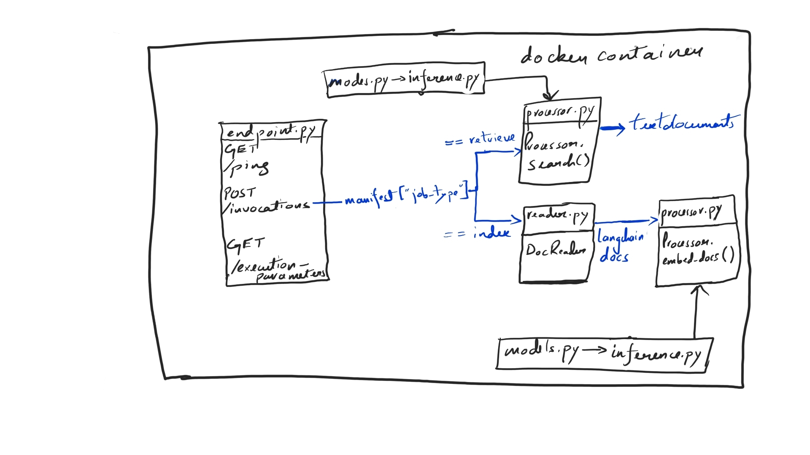

# sagmaker-custom-container-rag-template
Template for a RAG system using sagemaker model Endpoints and Batch transform jobs

## Blog
https://medium.com/@ashutosh.singh.de/rag-with-aws-sagemaker-step-by-step-guide-1ad970cc43f6

## Code architecture


## Build Image

```
cd app
// Build the image named batch with v1 tag
docker build --tag sagemaker-container:v1 .
```

## Push Image to ECR

```
// Tag the image with the ECR repository path.
// aws-account-id: This is your aws account id.
// ecr-repo-region: Region in which ecr repo exists. For example: `us-east-1`
// ecr-repo-name: Name of the repository.
docker tag sagemaker-container:v1 {aws-account-id}.dkr.ecr.{ecr-repo-region}.amazonaws.com/{ecr-repo-name}:v1

// Login to aws-ecr
aws ecr get-login-password --region {ecr-repo-region} | docker login --username AWS --password-stdin {aws-account-id}.dkr.ecr.{ecr-repo-region}.amazonaws.com
// Finally push the image to the respository
docker push {aws-account-id}.dkr.ecr.{ecr-repo-region}.amazonaws.com/{ecr-repo-name}:v1
```


## Submit batch transform job
[code](https://gist.github.com/ashutoshsingh0223/c4b66329e462665bb2e6a79d54c002b9#file-submit_transform_job-py)

## Invoke Endpoint
[code](https://gist.github.com/ashutoshsingh0223/d126ae7b9f60c8e84f2e1bbcc4bfb5d8#file-invoke_sagemaker_endpoint-py)


